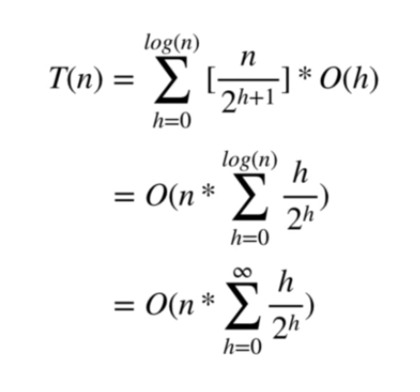

## 与普通队列的区别
- 保证每次取出的元素是队列中优先级最高的(java实现-堆排序)
- 优先级别可自定义

## 本质
二叉堆(binary heap)
* 二叉堆满足堆特性：父节点的键值总是保持固定的序关系于任何一个子节点的键值，且每个节点的左子树和右子树都是一个二叉堆。
* 当父节点的键值总是大于或等于任何一个子节点的键值时为“最大堆”。当父节点的键值总是小于或等于任何一个子节点的键值时为“最小堆”。
* 二叉堆一般用数组来表示。如果根节点在数组中的位置是1，第n个位置的子节点分别在2n和 2n+1。因此，第1个位置的子节点在2和3，第2个位置的子节点在4和5。以此类推。这种基于1的数组存储方式便于寻找父节点和子节点。
* 如果存储数组的下标基于0，那么下标为i的节点的子节点是2i + 1与2i + 2；其父节点的下标是⌊floor((i − 1) ∕ 2)⌋ 
#### 基本操作
- 向上筛选 O(logn)
    新元素放置到堆底, 不断和父节点对比优先级&交换, 直到不能交换为止
    
- 向下筛选 O(logn)
    取出堆顶优先级最高元素后, 取一个底部元素放置到堆顶, 然后不断和子节点对比优先级&交换, 直到不能交换为止
    
- 优先队列的初始化O(n)

    

## 常用场景
从无序数据中按照一定顺序(优先级)筛选数据
lc:找出数组中前k大的树

